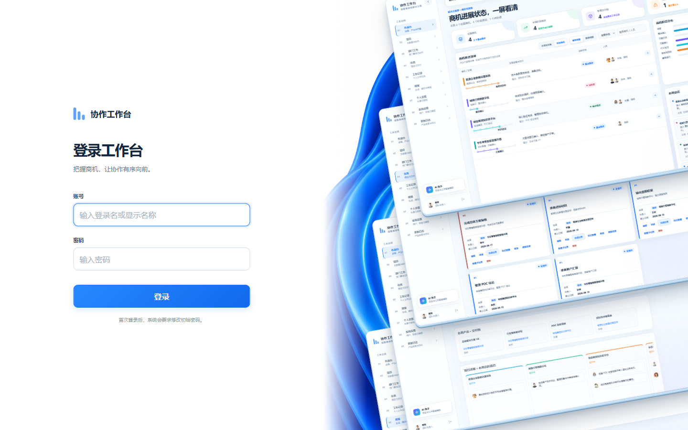
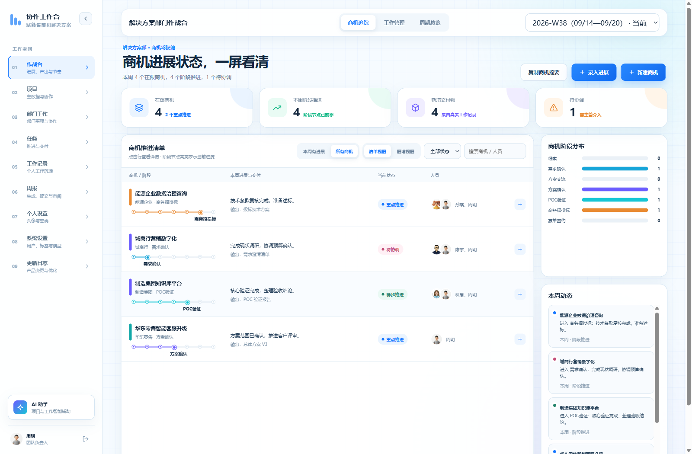
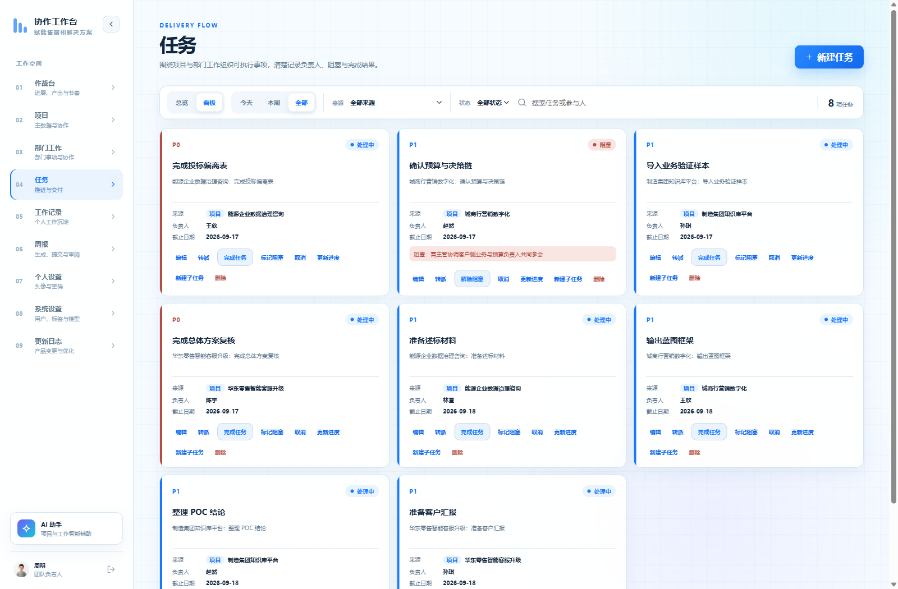
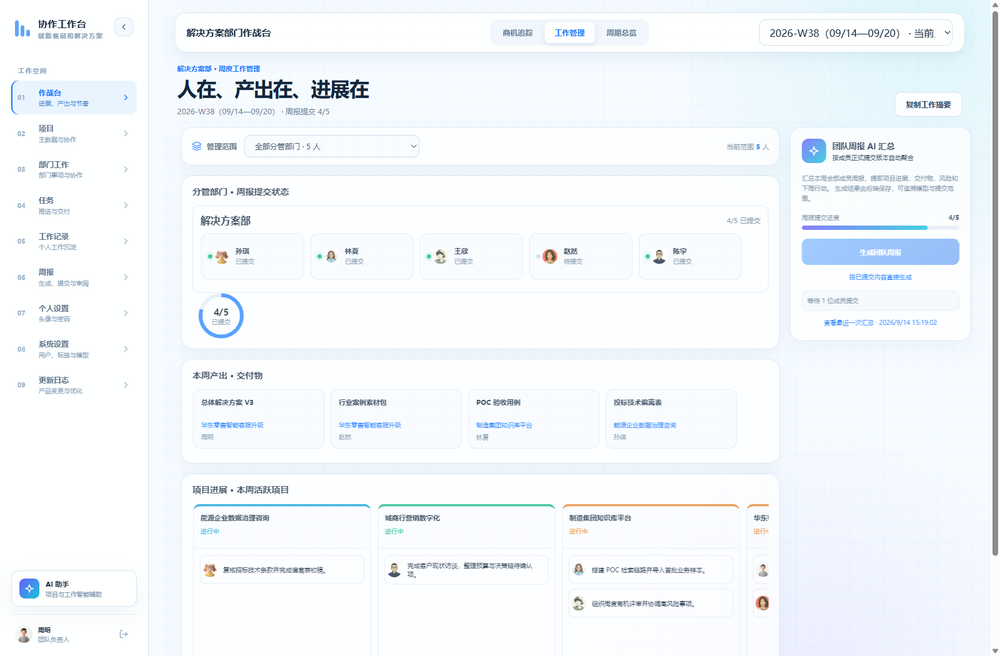
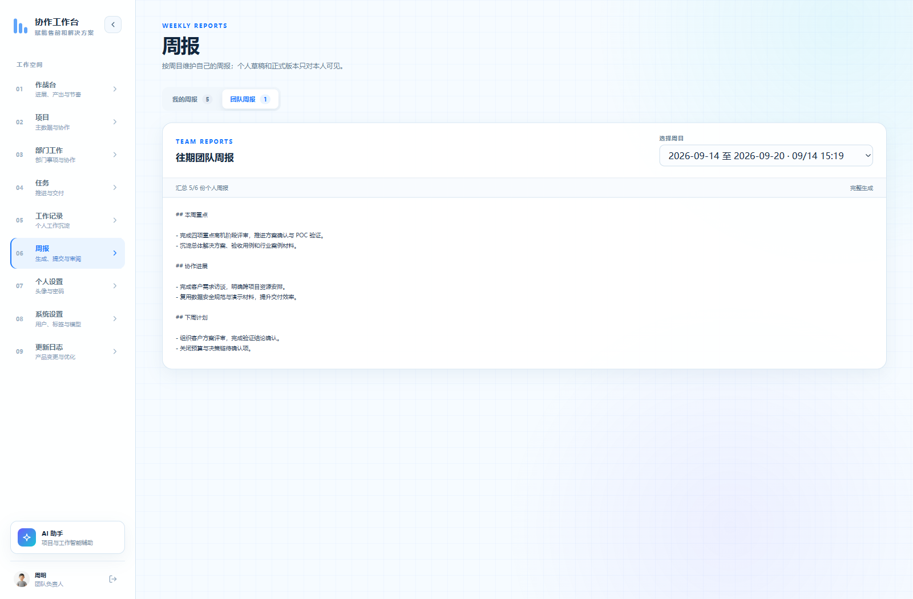
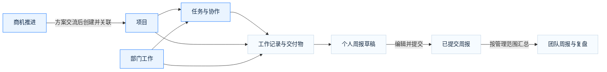

<div align="center">

# 协作工作台

### 把握商机，让协作有序向前。

从商机推进到项目交付，从个人记录到团队复盘。<br />
把分散的进展、任务与成果，放回同一个工作现场。

[](https://github.com/OOOliver0428/lx_workbench/actions/workflows/ci.yml)


[产品能力](#产品能力) · [界面一览](#界面一览) · [快速开始](#快速开始) · [部署指南](docs/UBUNTU_DEPLOYMENT.md) · [更新日志](CHANGELOG.md)



</div>

## 让协作围绕事情展开

**协作工作台是一套可自行部署的团队协作系统，连接商机、项目、部门事项、任务、工作记录与周报。**

它从售前和解决方案团队的真实工作场景出发，支持围绕项目组织人员、跨部门协同，以及按管理范围查看团队进展。个人每天留下的工作记录，能够关联到具体任务与交付物，并成为周报和团队复盘的依据。

| 你关心的事 | 在工作台里怎么做 |
| :--- | :--- |
| 商机走到哪一步，哪些需要协调？ | 查看阶段节点、本周推进、关注状态和关联项目 |
| 项目由谁负责，任务卡在哪里？ | 查看成员分工、任务层级、负责人、阻塞原因和完成结果 |
| 不属于项目的部门事项怎么跟进？ | 建立部门工作，选择可见范围，关联任务与工作记录 |
| 团队这周交付了什么？ | 按分管部门或直属范围查看人员提交、交付物与项目贡献 |
| 周报如何减少重复整理？ | 从工作记录生成个人草稿，再用已提交版本汇总团队周报 |

## 产品能力

### 01 · 作战台：进展、产出与节奏

一个入口，三个观察视角：

- **商机追踪**：清单与图谱视图、商机阶段分布、关注状态、本周动态，以及追加式进展记录。
- **工作管理**：按全部分管部门、单个分管部门或其他直属成员切换范围，联动查看周报提交、交付物、项目工作贡献与团队汇总。
- **周期总览**：跨周趋势、提交矩阵和阶段时间线，让连续几周的变化有迹可循。

### 02 · 商机、项目与部门工作：各有归属，也能衔接

- **商机独立管理**：记录客户、负责人、参与人、推进阶段与关注状态；进入方案交流后，可创建并关联项目。
- **项目组织协作**：支持成员与负责人、标签、父子层级、状态流转、查重与合并；负责人可按权限维护项目名称。
- **部门工作承接日常事项**：把内部建设、公共事务等非项目工作纳入跟进，支持“仅本部门”与“全员公开”两类可见范围。

### 03 · 任务：把推进落实到人

总览与看板两种方式查看任务，按时间、来源和状态筛选。任务可以关联项目或部门工作，记录优先级、负责人、协作者与截止日期，支持子任务、转派、进度更新、阻塞处理及完成结果；跨项目任务也可以建立关联。

### 04 · 工作记录：留下过程，也留下成果

记录每天做了什么、投入多久、形成什么交付物，以及风险与下一步行动。工作记录可关联项目、部门工作和任务，也可先记录、后归集。

投入时间支持圈选 **30 分钟时间块**，自动计算工时。当天已录入时段以斜纹提示，便于检查安排；提示允许并行工作重叠，不强制排他。

### 05 · 周报与 AI：从事实出发，减少重复整理

- **个人周报**：根据本周工作记录生成草稿，编辑后提交；个人草稿和正式版本只对作者本人可见。
- **团队周报**：在授权的管理范围内，根据成员已提交的周报版本汇总；不同范围分别保存，支持历史回看。
- **AI 助手**：结合授权范围内的业务上下文进行多轮交流，辅助梳理进展、风险和下一步行动。
- **模型接入**：内置 DeepSeek、智谱 GLM、Kimi、MiniMax 接入选项，可配置模型名称、测试连接并保存配置。

AI 输出供人确认，**不会自动修改业务数据**。启用 AI 需要自行配置厂商密钥与网络访问；调用时，相关业务上下文会发送至所配置的模型服务。

### 06 · 权限与体验：让协作有边界

按功能授权，并结合角色、负责人、成员关系与部门范围控制操作。部门查看与管理、用户管理、标签、大模型配置、审计等能力可以分别授权。工作管理还受团队角色与有效直属成员等条件约束，具体规则见 [API 与权限契约](docs/API_CONTRACT.md)。

系统提供账号冻结与解冻、首次登录改密、服务端会话、CSRF 防护、并发修改校验、软删除和操作审计。界面支持拼音搜索、可折叠导航与移动端适配；登录页采用真实界面堆叠和缓慢微动，并尊重系统的“减少动态效果”设置。

## 界面一览

以下为当前代码在独立测试数据库中的真实截图，使用虚构业务数据。页面入口与可操作范围随账号权限变化。

### 商机追踪 · 一屏看清推进状态



<details>
<summary><strong>展开更多界面：任务看板、工作管理、团队周报</strong></summary>

#### 任务看板

负责人、优先级、截止日期和阻塞信息直接呈现在卡片中。



#### 周度工作管理

按管理范围查看成员提交状态、交付物、项目进展与团队 AI 汇总。



#### 团队周报

查看按周保存的团队汇总，回顾重点进展与后续计划。



</details>

## 一条连贯的工作路径



## 快速开始

### 本地运行

准备 **Python ≥ 3.12、[uv](https://docs.astral.sh/uv/)、Node.js ≥ 22.13 和 npm**。以下命令使用 PowerShell，适合 Windows 本地开发。

```powershell
git clone https://github.com/OOOliver0428/lx_workbench.git
cd lx_workbench
uv sync --all-groups
Copy-Item .env.example .env
uv run python -m app.cli upgrade-db
uv run python -m app.cli create-user admin "系统维护账号" --role super_admin
uv run python server.py --reload
```

创建账号时会提示输入密码。此处创建的是初始化配置用的维护账号，日常使用可在系统中另建业务账号。

在另一个终端，进入刚克隆的 `lx_workbench` 目录后启动前端：

```powershell
cd frontend
npm ci
npm run dev
```

打开 **[http://127.0.0.1:5174](http://127.0.0.1:5174)**。后端默认监听 `127.0.0.1:8787`，浏览器通过前端同源 `/api` 访问。

<details>
<summary><strong>Windows 联调脚本与演示数据</strong></summary>

完成首次环境准备后，也可在仓库根目录使用统一脚本启动前后端、执行迁移和检查健康状态。使用它时先停止手动启动的服务。

```powershell
.\scripts\windows-test.cmd start -AutoSelectPorts
.\scripts\windows-test.cmd status
.\scripts\windows-test.cmd stop
```

想先体验完整流程，可在独立测试库中创建演示数据。在当前 PowerShell 终端指定测试库后执行，密码通过交互输入：

```powershell
$env:MVP_DATABASE_URL = "sqlite:///./data/demo.db"
uv run python -m app.cli seed-demo-data
uv run python server.py --reload
```

这会让该终端启动的后端使用演示库。演示账号、数据范围和重复执行规则见 [演示数据手册](docs/DEMO_DATA.md)。

</details>

### 部署到 Ubuntu

支持 Ubuntu 22.04 / 24.04 LTS 单节点部署。下列为受控内网试运行入口；正式发布版本的选择与标签规则见 [发布规范](docs/RELEASING.md)。

```bash
git clone --branch main --single-branch https://github.com/OOOliver0428/lx_workbench.git
cd lx_workbench
sudo bash deploy/ubuntu/install.sh --public-host 服务器IP或内网域名
sudo solution-workspace create-admin admin "系统维护账号"
sudo solution-workspace health
sudo solution-workspace backup
```

安装脚本负责依赖、前端构建、数据库迁移、systemd 服务和每日备份定时任务。默认入口为 `http://服务器IP:5174/`。

**升级、回滚、备份恢复、试用库转正式库、HTTPS 和故障排查，请使用 [Ubuntu 部署与运维手册](docs/UBUNTU_DEPLOYMENT.md)。** Windows 还可通过根目录 `生成离线升级包.cmd` 制作代码升级 bundle；它不包含完整的离线依赖。

## 自行部署，清楚掌握数据流向

| 层级 | 实现 |
| :--- | :--- |
| 界面 | React 19 · TypeScript · Vinext / Vite |
| 服务 | FastAPI · SQLAlchemy · Alembic |
| 数据 | 本机 SQLite · WAL · 一致性备份 |
| 接入 | 浏览器 → 前端同源代理 → 内部 API |
| AI | 后端调用已配置的模型服务；密钥加密存储，不向浏览器回显 |

当前按**受控内网或 VPN、单节点试运行**设计。数据库放在服务器本机磁盘，不使用共享文件盘，也不启动多个 worker 共享 SQLite。HTTP 入口不直接暴露公网；正式推广前需配置 HTTPS、异机备份，并完成容量与恢复验证。

数据库备份与 `MVP_LLM_CONFIG_SECRET` 需要一并妥善保管，后者用于解密已保存的模型密钥。详细拓扑、配置与恢复流程统一维护在部署文档中。

## 开发与文档

```text
app/          后端接口、领域服务与管理命令
frontend/     页面、组件、样式与前端测试
alembic/      数据库迁移
deploy/       Ubuntu 安装、运维与 systemd 模板
tests/        后端、权限与部署资产测试
docs/         接口、部署、产品与发布文档
```

本地验证：

```powershell
uv run ruff check app tests
uv run pytest
npm --prefix frontend run lint
npm --prefix frontend test
```

| 入口 | 内容 |
| :--- | :--- |
| [更新日志](CHANGELOG.md) | 版本记录与尚未发布的变更 |
| [部署与运维](docs/UBUNTU_DEPLOYMENT.md) | 安装、升级、备份、回滚和排障 |
| [API 与权限契约](docs/API_CONTRACT.md) | 接口行为与访问边界 |
| [演示数据](docs/DEMO_DATA.md) | 演示账号与测试场景 |
| [周度历史说明](docs/WEEKLY_HISTORY.md) | 历史周报与成员范围口径 |
| [版本发布规范](docs/RELEASING.md) | 分支、标签、版本号与发布流程 |
| [产品需求参考](docs/PRODUCT_REQUIREMENTS_V2.md) | 需求背景与设计参考，具体实现以当前代码为准 |

`main` 为发布主线，`dev` 为日常集成分支。README 展示当前主线能力；正式版本与未发布变更请查看 [CHANGELOG](CHANGELOG.md)，部署前按 [发布规范](docs/RELEASING.md) 选择版本。
