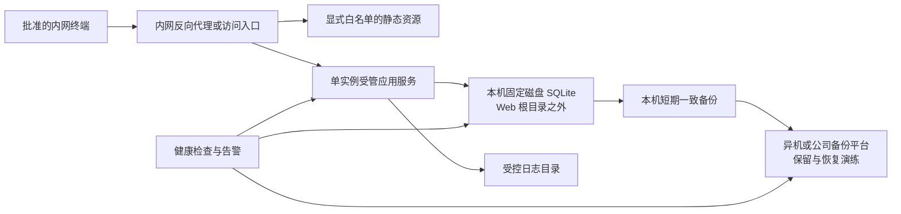

# 解决方案团队作战台 V2 产品需求说明

| 项目 | 内容 |
|---|---|
| 文档版本 | V2.0 草案 |
| 编制日期 | 2026-07-20 |
| 基线版本 | 《解决方案团队作战台 V1 产品需求说明》 |
| 审查基线 | 《生产上线对抗性审查与完整整改书》《公司内网轻量部署整改方案（数据安全优先）》 |
| 适用团队 | 解决方案团队，初始 3 人：2 名解决方案专家、1 名技术专家 |
| 产品形态 | 公司受控内网中的部门级轻量 Web 应用 |
| 部署档位 | 单节点、单应用实例、本机 SQLite、异机备份 |
| 文档状态 | 用于 V2 需求评审、技术设计、开发拆分、测试验收和上线评审 |

## 1. 文档目的

本文档在 V1 业务需求基础上，定义“解决方案团队作战台”V2 的完整产品范围，并将此前生产对抗性审查中与本项目实际风险匹配的整改项转化为可实现、可测试、可验收的正式需求。

V2 不以建设高安全等级平台为目标。系统定位为受控公司内网中的小团队轻量应用，允许保留单节点和 SQLite，也暂不强制接入企业 SSO、建设高可用集群或迁移 PostgreSQL。但以下能力不得降级：

1. 用户看到“保存成功”后，数据已经由服务端确认并持久化；
2. 多人同时操作时不得静默覆盖或丢失数据；
3. 程序启动、页面加载和版本升级不得隐式删除、重写或注入业务数据；
4. 数据库、备份、日志和源码不得作为静态文件被浏览器下载；
5. 数据必须有异机备份，且能够从空环境恢复并完成对账；
6. 导入、迁移、删除和修复必须可预览、可追溯、可回滚；
7. 上线结论必须由测试证据决定，不以“功能可打开”代替生产验收。

本文档是后续原型、技术方案、数据迁移、测试用例、运维手册和 Go/No-Go 评审的共同基线。若实现与本文档冲突，以经正式评审确认的需求变更记录为准。

## 2. V1 到 V2 的主要变化

| 主题 | V1 | V2 |
|---|---|---|
| 产品定位 | 团队内部轻量 Web 系统 | 受控公司内网中的轻量生产服务 |
| 数据来源 | 强调业务对象和自动汇总 | 服务端为唯一事实源，客户端不保留可分叉的正式副本 |
| 保存方式 | 未定义并发与确认语义 | 实体级写入、事务、版本号、乐观锁和明确保存状态 |
| 数据结构 | 业务字段为主 | 增加稳定 ID、revision、审计字段、软删除和版本快照 |
| 导入与迁移 | 预览后导入 | 严格校验、差异预览、事务应用、预备份、对账和回滚 |
| 删除与修复 | 软删除、保留日志 | 禁止启动时隐式修复；批量变更必须显式触发并可撤销 |
| SQLite | 未限定运行边界 | 限单节点、本机磁盘、WAL、连接关闭、锁等待和完整性检查 |
| 备份 | 定期备份 | RPO/RTO、异机副本、保留策略、告警和恢复演练 |
| 认证安全 | 3 个独立账号 | 保留轻量账号；网络入口受控；企业 SSO 不是默认阻断项 |
| 上线标准 | 核心业务验收 | 业务、数据正确性、恢复、运维和发布证据共同验收 |

V1 中未被本文档明确变更的业务规则继续有效；本文档已将上线所需规则整合为自包含版本，实施和验收无需同时引用 V1。

## 3. 建设背景与产品定位

### 3.1 建设背景

解决方案团队的工作主要围绕销售商机和项目推进，包含客户调研、方案编制、技术验证、汇报交流、投标报价、会议沟通和内部协调。当前需要解决：

1. 商机和项目缺少统一台账，责任人、阶段、金额、风险和下一步不易集中掌握；
2. 任务分散在会议、聊天和个人记录中，责任人、截止时间和结果容易遗漏；
3. 日程、会议结论、后续任务和产出物之间缺少关联；
4. 已完成、进行中、计划中和待补齐信息容易混淆；
5. 周报月报依赖人工回忆和二次整理；
6. 当前原型采用整份状态读写，存在并发覆盖、假保存、隐式数据修改和不可恢复等风险，不能直接作为内网生产服务。

### 3.2 一句话定位

以商机和项目为主线，以任务和日历为执行载体，以工作动态为事实记录，以周报月报为管理输出，并以“写入可信、历史可追、备份可恢复”为生产底线的轻量团队作战台。

### 3.3 业务闭环

### 3.4 核心原则

1. **一次录入，多处复用**：业务事实录入一次，可用于详情页、任务、日历、提醒和报告。
2. **事实优先**：计划、进行中、已完成和待补齐严格区分；系统不得推测不存在的事实。
3. **低负担记录**：允许简短补记和后续补齐，不强制长篇日报。
4. **结果导向**：任务有完成结果，会议有结论或明确的“未形成结论”，事项有下一步和责任人。
5. **小团队适配**：不引入不必要的多组织、多租户、复杂审批和高可用组件。
6. **服务端事实源**：浏览器只展示和提交操作，不能在断线时形成另一套正式数据。
7. **不静默失败**：失败、冲突、未同步、待重试必须对用户可见。
8. **可恢复优先**：备份是否可用由恢复验证决定，而不是由文件是否存在决定。

## 4. 适用边界与前提

V2 轻量架构成立需要同时满足以下前提：

- 仅部署在公司受控内网、批准的办公网段或 VPN 范围内，不向互联网开放；
- 不允许访客 Wi-Fi、非受管终端或无关组织网段直接访问；
- 初始用户为 3 人，默认容量基线为不超过 10 名活跃用户和 10 个并发客户端；
- 业务接受单节点维护窗口和单机故障期间暂时不可用，不要求 7×24 高可用；
- SQLite 主库位于应用服务器本机固定磁盘，不位于 NFS、SMB、网盘同步目录或移动磁盘；
- 数据默认为普通内部业务数据，不存储密码、密钥、身份证件、银行卡、健康数据或依法需要更高保护级别的数据；
- 运维能够提供服务守护、固定数据目录、异机备份位置、磁盘监控和基本告警；
- 数据所有者在上线前确认数据等级、单节点接受、用户范围、RPO、RTO 和保留期。

任一前提不成立时，必须重新进行架构评审；不得直接沿用本文的 SQLite 轻量例外。

## 5. 建设目标与非目标

### 5.1 V2 建设目标

| 编号 | 目标 | 衡量方式 |
|---|---|---|
| G-01 | 建立统一商机和项目台账 | 所有在跟商机和项目可在一张表中查询、筛选和追溯 |
| G-02 | 明确工作的责任人与时限 | 任务有主责任人、状态、优先级及截止时间或待补齐标识 |
| G-03 | 形成会议到行动的闭环 | 会议可沉淀结论，下一步可事务性生成任务 |
| G-04 | 降低记录负担 | 支持快速补记，未识别内容不被虚构 |
| G-05 | 自动形成可信报告 | 周报月报由结构化事实聚合，发布后形成不可被基础数据覆盖的版本 |
| G-06 | 提升管理透明度 | 可查看进展、逾期、阻塞、风险和成员任务分布 |
| G-07 | 防止静默丢写和假保存 | 并发陈旧写返回冲突；服务端未确认时不得显示保存成功 |
| G-08 | 保证数据可恢复 | 达到已签 RPO/RTO，异机备份可从空环境恢复并对账 |
| G-09 | 支持受控生产运行 | 目标服务器可重复部署、升级、监控、备份和回滚 |

### 5.2 V2 明确不做

- 完整 CRM、营销自动化、合同、回款、开票和财务管理；
- 多级组织、多租户、复杂审批、精细工时、绩效和薪酬；
- 大型知识库、文档在线编辑和全量聊天记录采集；
- 外部日历双向同步和外部消息推送，列入后续版本；
- 无网离线编辑、浏览器本地正式副本或断线后自动合并；
- AI 自动生成不存在的客户结论、金额、风险、负责人或截止时间；
- 默认建设 PostgreSQL、数据库高可用、应用多实例或分布式链路追踪；
- 默认接入企业 SSO。若公司制度要求或访问范围扩大，再升级为上线必需项；
- 在系统内托管产出物正文。V2 只记录受控文件路径或链接及版本元数据。

## 6. 用户、角色与权限边界

### 6.1 角色

| 角色 | 主要职责 | 核心权限 |
|---|---|---|
| 团队负责人 | 管理全局、分派工作、确认报告 | 查看和维护全部业务数据；调整责任人；关闭记录；恢复软删除数据；发布报告 |
| 解决方案专家 | 调研、方案、汇报、投标和客户沟通 | 查看团队数据；维护商机项目；创建和处理任务；记录会议、动态和产出物 |
| 技术专家 | 技术调研、验证、架构和技术支持 | 查看团队数据；处理技术任务；记录技术结论、风险和产出物 |
| 运维管理员 | 部署、备份、恢复、监控和升级 | 管理运行环境和备份；默认不修改业务内容；运维操作必须留痕 |

团队负责人由现有成员兼任，不代表新增人员编制。

### 6.2 轻量权限原则

- 业务成员使用独立账号登录，全员可见本团队业务数据；
- V2 可使用本地账号或可信内网网关身份，暂不强制 SSO；密码不得明文存储；
- 不允许匿名写入；运维健康检查可以匿名，但不得返回业务数据、物理路径或备份文件名；
- 普通成员可维护本人负责事项，并可创建业务记录和补充动态；
- 负责人控制关闭、恢复、永久清理和报告发布等关键操作；
- 永久删除默认不开启。确需清理时，必须按保留策略、审批记录和独立备份执行；
- 审计中的操作者以服务端确认的账号为准，不信任客户端提交的 `created_by` 或 `updated_by`；
- 如果业务决定使用共享账号，必须书面接受无法精确到个人追责的风险，但仍不得取消数据版本、备份和恢复要求。

## 7. 信息架构与页面结构

V2 一级页面保持 5 个，设置与运维状态为辅助入口。

| 页面 | 主要内容 | 核心操作 |
|---|---|---|
| 首页工作台 | 重点商机项目、我的任务、近期日程、逾期阻塞、待补记、数据状态 | 快速查看、新增、补记、处理冲突或失败 |
| 商机/项目 | 统一大表、保存视图、详情和时间线 | 新建、编辑、转项目、变更阶段、查看历史 |
| 团队任务 | 我的任务、团队任务、列表和看板 | 创建、分派、转派、更新状态、提交结果 |
| 团队日历 | 月/周/日视图、会议和任务节点 | 新建日程、补记结论、生成任务 |
| 周报月报 | 报告草稿、已发布版本、对比和导出 | 生成、修订、发布、查看事实来源 |

辅助入口包括：团队成员、基础枚举、提醒、导入导出、回收站、操作历史、系统状态和数据管理。

### 7.1 首页工作台

首页默认展示：

1. 在跟商机数、在跟项目数、本周到期任务、逾期任务和待补记会议；
2. P0、近期关键节点和超过 7 天未更新的商机项目；
3. 当前用户今日到期、本周到期、阻塞和逾期任务；
4. 今日及未来 7 天会议、汇报、投标和验收节点；
5. 待补齐结论、结果、金额、责任人和截止时间的事项；
6. 中高风险、资源冲突和需要负责人介入的事项；
7. 当前连接状态、最近一次成功同步时间；
8. 仅负责人和运维可见的备份新鲜度、数据库就绪状态和异常提醒。

## 8. 领域数据模型

### 8.1 公共字段与存储规则

除纯关联表外，所有可修改业务实体必须包含：

| 字段 | 规则 |
|---|---|
| `id` | 服务端生成的稳定唯一标识，迁移后不得复用 |
| `revision` | 从 1 开始递增的实体版本号，每次成功修改加 1 |
| `created_at` / `updated_at` | 服务端时间，数据库中统一存 UTC，界面按 Asia/Shanghai 显示 |
| `created_by` / `updated_by` | 服务端根据登录身份记录 |
| `deleted_at` / `deleted_by` | 软删除标记；未删除时为空 |

通用规则：

- 金额使用整数分或定点十进制存储，禁止二进制浮点直接计算；
- 工时和时长使用整数分钟存储；
- 空值表示“未知/待补齐”，不得用 0、空字符串或虚构值替代；
- 枚举、长度、时间范围、外键、唯一性和状态转换由服务端校验；
- 正式业务数据不得只存在于浏览器缓存；
- SQLite 启用外键约束，并通过唯一、检查和非空约束保护关键规则。

### 8.2 团队成员 `team_members`

| 字段 | 必填 | 说明 |
|---|---:|---|
| `member_no` | 是 | 团队内唯一编号 |
| `display_name` | 是 | 显示名称 |
| `role` | 是 | 团队负责人、解决方案专家、技术专家 |
| `login_name` | 是 | 登录名，唯一 |
| `status` | 是 | 启用、停用 |
| `password_hash` 或 `external_subject` | 条件必填 | 本地账号存强哈希；网关身份存外部主体标识 |

停用成员不再允许登录和被分派新任务，但历史责任关系必须保留。

### 8.3 商机/项目 `business_records`

| 字段 | 必填 | 说明与规则 |
|---|---:|---|
| `record_type` | 是 | 商机、项目 |
| `business_no` | 是 | 同类型内唯一 |
| `source_opportunity_id` | 否 | 项目由商机转化时记录来源 |
| `customer_name` | 是 | 客户正式名称或当前已知名称 |
| `project_name` | 是 | 商机或项目名称 |
| `amount_minor` | 否 | 最小货币单位整数；未知时为空 |
| `amount_status` | 是 | 待补齐、预估、已确认 |
| `currency` | 是 | 默认 CNY |
| `sales_owner_text` | 否 | 销售可不是系统用户 |
| `presales_owner_id` | 是 | 解决方案主责任人 |
| `technical_owner_id` | 否 | 技术负责人 |
| `stage` | 是 | 与记录类型对应的阶段 |
| `priority` | 是 | P0、P1、P2 |
| `next_action` / `next_action_at` | 否 | 缺失时标记待补齐 |
| `risk_level` | 是 | 无、低、中、高 |
| `risk_description` | 条件必填 | 风险不为“无”时必填 |
| `status` | 是 | 进行中、暂停、赢单、输单、关闭等，与类型联动 |

阶段变更必须写入 `stage_history`，记录变更前后值、说明、操作者和发生时间。

### 8.4 任务 `tasks`

| 字段 | 必填 | 说明与规则 |
|---|---:|---|
| `title` | 是 | 明确、可执行的任务名称 |
| `record_id` | 是 | 所属商机/项目；临时任务进入待归集区 |
| `task_type` | 是 | 调研、方案、汇报、报价、投标、测试、技术验证、协调、其他 |
| `owner_id` | 是 | 唯一主责任人 |
| `collaborator_ids` | 否 | 多名协作人，通过关联表保存 |
| `priority` | 是 | P0、P1、P2 |
| `status` | 是 | 待办、进行中、阻塞、已完成、已取消 |
| `start_at` / `due_at` / `completed_at` | 否 | 按状态规则记录 |
| `result` | 条件必填 | 已完成时必填 |
| `blocker` | 条件必填 | 阻塞时必填 |
| `cancel_reason` | 条件必填 | 已取消时必填 |
| `source_event_id` | 否 | 来源于会议下一步时记录 |

任务转派写入独立历史，保留原责任人、新责任人、原因和时间。

### 8.5 日程/会议 `events`

| 字段 | 必填 | 说明与规则 |
|---|---:|---|
| `title` | 是 | 会议或日程名称 |
| `event_type` | 是 | 客户会议、内部会议、方案汇报、测试、投标、谈判、里程碑、其他 |
| `record_id` | 否 | 未关联时进入待整理 |
| `start_at` / `end_at` | 是 | 结束时间不得早于开始时间 |
| `participants` | 否 | 内部成员通过关联表保存，外部人员保存显示文本 |
| `status` | 是 | 计划中、已完成待补记、已完成已归档、已取消 |
| `conclusion` | 条件必填 | 归档时填写；可明确写“本次未形成结论” |
| `next_action` / `next_owner_id` / `next_due_at` | 否 | 会后下一步 |

从会议生成任务时，会议更新和任务创建必须在同一事务内完成，重复点击不得生成重复任务。

### 8.6 工作动态 `activities`

工作动态包含人工补记、阶段变化、任务变化、会议结论、风险变化和成果更新。主要字段包括 `record_id`、`activity_type`、`happened_at`、`content`、`result`、`next_action`、`owner_id`、`due_at`、`source_type` 和 `source_id`。

系统动态由服务端在业务事务内生成，不能依赖客户端补写。人工动态允许分步补齐，但每次修改均增加 revision 并记录审计。

### 8.7 产出物 `deliverables` 与 `deliverable_versions`

产出物记录名称、类型、所属商机/项目、来源任务和说明。每个版本记录版本号、路径或链接、创建人、创建时间和摘要。

- 同一产出物允许多个版本；
- V2 不读取或复制用户无权访问的外部文件；
- 页面展示路径或链接时必须做安全编码，不得执行其中的 HTML 或脚本；
- 报告引用具体产出物版本，而不是始终引用“最新版本”。

### 8.8 报告 `reports` 与 `report_versions`

报告包含周报或月报类型、统计周期、团队或成员范围、状态、当前版本和发布时间。每次生成或人工保存产生可追溯版本；发布版本必须保存正文和事实来源快照。

- 基础数据后续变化不得自动覆盖已发布版本；
- 重新发布形成新版本，不得原地篡改旧版本；
- 报告版本可追溯到被引用的任务、会议、动态和产出物 ID；
- 报告生成失败不改变基础数据或已发布版本。

### 8.9 审计、导入和迁移元数据

- `audit_events`：记录操作者、动作、对象类型、对象 ID、前后 revision、时间、结果和 request ID；
- `import_jobs`：记录文件摘要、映射、校验结果、差异、执行人、状态、成功/失败数量和回滚点；
- `schema_migrations`：记录数据库结构版本、执行时间、制品版本和结果；
- 审计日志不保存密码、会话令牌或完整敏感请求体。

## 9. 功能需求

### 9.1 商机/项目管理

#### F-BR-01 统一大表

默认展示类型、业务编号、客户、项目名称、金额及状态、销售、售前和技术负责人、阶段、优先级、下一步、风险、状态和最后更新时间。

必须支持：

- 按类型、阶段、负责人、客户、优先级、状态和时间筛选；
- 按金额、下一步时间、最后更新时间和优先级排序；
- 保存“我的商机”“本周重点”“长期未更新”“待补齐金额”等视图；
- 行内修改阶段、优先级、负责人和下一步；
- 点击进入详情页；
- 按当前筛选范围导出；
- 所有行内修改遵守统一保存、冲突和审计规则。

#### F-BR-02 详情页

详情页包含基础信息、阶段历史、下一步、任务、日程会议、动态时间线、产出物、风险阻塞和来源商机/关联项目。

#### F-BR-03 商机转项目

当商机进入赢单阶段时，可显式执行“转为项目”：

1. 复制客户、名称、金额、销售、售前和技术负责人；
2. 要求填写项目编号和启动阶段；
3. 保留来源商机和历史；
4. 原商机保持赢单，不被项目覆盖；
5. 用户预览未完成任务的迁移清单并选择迁移或保留；
6. 项目创建、来源关联和任务迁移在一个事务内完成；
7. 同一请求重复提交只产生一个项目。

### 9.2 团队任务管理

#### F-TSK-01 创建与分派

任务可从商机项目详情、任务页、会议下一步和快速补记创建。每项任务必须有名称、所属商机/项目或待归集标识、主责任人、状态和优先级。截止时间可暂缺，但必须显示待补齐。

#### F-TSK-02 任务视图

至少提供我的待办、我的已办、团队全部、状态看板、按人员分组、按商机项目分组、逾期、阻塞和本周完成视图。

#### F-TSK-03 状态流转

- 待办转进行中：记录实际开始时间；
- 进行中转阻塞：必须填写阻塞原因，可指定协助人；
- 阻塞恢复进行中：保留阻塞历史；
- 转已完成：必须填写完成结果；有正式成果时关联产出物；
- 转已取消：必须填写取消原因；
- 已完成和已取消默认进入已办；
- 非法状态跳转由服务端拒绝，不得只依赖前端按钮隐藏。

#### F-TSK-04 转派

转派不清空动态和产出物。临近截止或已逾期时显示风险提示。责任人变更和历史写入必须原子完成。

### 9.3 日历与会议

- 提供月、周、日视图；统一展示客户会议、内部会议、方案汇报、技术测试、投标报价谈判节点、任务截止和项目里程碑；
- 新建日程至少填写标题、类型、开始结束时间、参与人和创建人；
- 客户会议等优先关联商机/项目，未关联时进入待整理；
- 会议结束但没有结论时，变为“已完成待补记”，不得计入已完成成果；
- 会后可补充结论、下一步、责任人、截止时间和产出物；
- 下一步可一键生成任务，并防止重复创建；
- 允许先记录时间和主题后再补结论，未知信息显示待补齐。

### 9.4 工作动态与快速补记

- 全局提供快速补记入口；
- 系统可识别时间、客户、事项、责任人和截止时间，但结果仅作为待确认草稿；
- 用户确认后才写入正式业务表；
- 无法识别的字段为空或待补齐；
- 不得补写用户未提供的会议结论、客户要求、金额和截止时间；
- 确认页必须展示将创建或修改的对象；
- 后续可增量补充原记录，不强制重复录入；
- 商机项目详情按时间倒序展示动态，并支持按任务、会议、阶段、风险和成果筛选。

### 9.5 产出物管理

V2 记录方案、PPT、报价、投标文件、测试报告、会议纪要和技术文档的元数据、路径或链接及版本。系统不建设大型文档库。

路径或链接变更需要保留版本历史；周报月报引用统计周期内的具体版本和路径，确保后续可追溯。

### 9.6 周报和月报

#### F-RPT-01 生成原则

1. 服务端按规则提取商机项目、任务、会议、动态和产出物；
2. AI 如启用，只负责结构化、去重、分类和语言润色；
3. 已完成、进行中、计划中和待补齐分开；
4. 只有排期没有结论的会议不得写成成果；
5. 无依据的客户结论、金额、风险和截止时间不得补写；
6. 每个事实项保留来源对象引用；
7. 生成结果先为草稿，由用户确认后发布；
8. AI 不可用时，规则聚合仍能生成完整草稿。

#### F-RPT-02 周报内容

周报默认包含总体概览、重点商机项目进展、阶段变化、本周完成任务、已确认会议结论、形成的产出物、进行中事项、风险阻塞、下周重点、成员任务分布和待补齐事项。

#### F-RPT-03 月报内容

月报默认包含总体概览、商机数量和金额分布、重点项目、客户触达、方案和技术成果、成员任务、共性需求、资源风险、下月重点和待补齐清单。

#### F-RPT-04 报告操作

- 按自然周或自然月、团队或成员、客户、项目和工作类型生成；
- 支持人工修订、保存草稿、发布和历史版本对比；
- 支持 Markdown 导出；Word/PDF 导出为 P1；
- 发布前显示统计周期、生成时间、数据截止时间和待补齐数量；
- 发布后的数据快照不随基础数据变化而改变。

### 9.7 提醒与待补齐

V2 提供站内提醒：任务临期、逾期、阻塞，会议临近和会后待补记，商机项目超过 7 天未更新、没有下一步、关键字段待补齐，报告草稿待确认，以及保存失败、冲突和系统数据状态异常。

提醒支持标记已读、稍后处理和进入对应记录。邮件和即时通信推送不属于 V2 P0。

### 9.8 搜索、导入与导出

#### F-DAT-01 全局搜索

支持按业务编号、客户、项目、任务、会议、产出物和责任人模糊搜索。搜索默认排除软删除数据，并遵守当前用户的数据范围。

#### F-DAT-02 导入

导入必须遵循以下流程：

1. 上传到隔离区，不直接写正式表；
2. 选择模板和字段映射；
3. 严格校验类型、必填项、枚举、金额、时间、长度、重复编号和外键；
4. 展示新增、修改、跳过、冲突和错误的差异预览；
5. 用户确认前自动建立可恢复点；
6. 在服务端事务中应用；出现整体性错误时全部回滚；
7. 输出成功和失败清单、导入任务编号及审计记录；
8. 重复提交同一导入任务不得重复写入；
9. 不接受 `NaN`、`Infinity`、非对象 JSON、未知顶层字段、超长文本、过深嵌套或超限文件。

#### F-DAT-03 导出

商机项目、任务、会议和报告支持按当前筛选范围导出。导出文件包含导出时间、数据截止时间、筛选范围和操作者。导出失败不得返回不完整文件并标记为成功。

### 9.9 统一保存、冲突与断线体验

#### F-SYNC-01 保存状态

所有编辑操作必须显示以下状态之一：

- 未修改；
- 有未保存修改；
- 正在保存；
- 已保存，并显示服务端确认时间；
- 保存失败，可保留输入并重试；
- 数据冲突，需要用户处理；
- 已离线，只读或禁止提交。

只有收到服务端成功响应并获得新 revision 后，界面才能显示“已保存”。

#### F-SYNC-02 并发冲突

客户端修改实体时必须提交其读取时的 revision。若服务端 revision 已变化，服务端返回 HTTP 409 或等价冲突结果，不覆盖最新数据。

冲突界面至少展示：

- 当前服务端版本；
- 用户尚未提交成功的修改；
- 冲突字段；
- 放弃本地修改并刷新；
- 复制内容后重新编辑。

V2 不要求自动字段合并。用户主动重新提交前，任何一方数据均不得被静默覆盖。

#### F-SYNC-03 断线规则

- 断线时系统进入只读或阻止提交；
- 已输入但未提交的表单内容可暂存在当前页面，必须明确标记“未保存”；
- 恢复连接后重新读取最新 revision，再由用户确认提交；
- 禁止将浏览器 `localStorage` 中的数据当作保存成功的正式记录；
- 关闭页面前若有未保存内容，应提示用户。

### 9.10 删除、回收站与历史

- 业务删除默认软删除；
- 删除前展示对象及受影响关联关系；
- 负责人可在保留期内从回收站恢复；
- 恢复时若唯一编号冲突，必须提示并由用户处理；
- 批量删除、批量替换和数据修复必须展示差异、二次确认并写审计；
- 页面加载、服务启动和普通查询不得触发删除、历史重分类、摘要清空或演示数据注入；
- 演示数据只允许存在于显式 demo 环境或自动测试 fixture 中。

## 10. 状态流转与业务规则

### 10.1 商机阶段

线索 → 初步接洽 → 需求调研 → 方案交流 → 测试验证 → 投标报价 → 商务谈判 → 赢单/输单。

任何进行中阶段可转为暂停，恢复后回到暂停前阶段。允许跳转，但必须填写说明并保留阶段历史。

### 10.2 项目阶段

项目启动 → 方案设计 → 技术验证 → 实施准备 → 建设实施 → 测试验收 → 运维支持 → 关闭。

团队不承担实施时，可从方案设计直接进入运维支持或关闭，但必须填写说明。

### 10.3 统计口径

| 指标 | 统计规则 |
|---|---|
| 在跟商机 | 尚未赢单、输单或关闭的有效商机；暂停单独显示 |
| 在跟项目 | 尚未关闭的项目 |
| 完成任务 | `completed_at` 落在周期内且状态为已完成 |
| 逾期任务 | 截止时间早于当前时间且状态不是已完成或已取消 |
| 完成会议 | 结束时间落在周期内；有结论才计入成果，无结论只计排期/待补记 |
| 形成产出物 | 新版本创建时间落在周期内 |
| 商机金额 | 只统计已填写金额；预估、已确认和待补齐分开，待补齐不按 0 计算 |
| 阶段变化 | 以服务端阶段变更日志时间为准 |

### 10.4 通用业务规则

1. 商机/项目编号在对应类型内唯一；
2. 商机/项目至少有 1 名售前负责人；
3. 风险等级不为“无”时必须填写风险说明；
4. 任务完成必须填写结果，阻塞和取消必须填写原因；
5. 临时任务可待归集，但报告生成时单独列入待补齐；
6. 会议没有结论时不得直接计为成果；
7. 阶段变化自动生成工作动态，二者必须在同一事务提交；
8. 超过 7 天没有动态的在跟记录进入长期未更新提醒；
9. 已发布报告保存版本和事实快照；
10. 所有关键字段修改、转派、关闭、删除、导入、恢复和发布均保留审计；
11. 所有日期边界以 Asia/Shanghai 展示和计算自然周、自然月，数据库时间存 UTC；
12. 自动任务、用户操作和导入使用同一套服务端校验和并发规则。

## 11. 数据安全与可靠性要求

本章中的 DS-L0 为 V2 上线阻断项。未满足时，无论业务功能完成度如何，结论均为 No-Go。

### DS-L0-01 服务端唯一事实源

- 正式业务数据只以服务端数据库为准；
- 不得以整份浏览器状态覆盖整库；
- 按业务实体提供创建、读取、修改、删除和专用动作接口；
- 前端默认轮询或按需刷新，不要求 WebSocket；
- 客户端缓存丢失不得导致服务端正式数据丢失。

### DS-L0-02 事务、乐观锁与幂等

- 每个可修改实体使用 revision/CAS；陈旧写返回冲突；
- 跨表业务动作必须使用数据库事务，成功则全部提交，失败则全部回滚；
- 创建、会议转任务、商机转项目、导入和报告发布支持幂等键或等价防重；
- SQLite 锁等待、冲突和重试不得被吞掉或伪装成成功；
- 并发测试必须证明没有 lost update 和 torn snapshot。

### DS-L0-03 严格输入与结构约束

- API 只接受已定义字段，未知字段按契约拒绝或显式忽略并记录；
- 对类型、枚举、范围、长度、数组数量、嵌套深度、请求大小和关联关系做服务端校验；
- 拒绝 `NaN`、`Infinity`、无穷日期、非法编码和非标准 JSON；
- 错误返回稳定错误码和可理解提示，不在响应中泄露堆栈、数据库路径或备份文件名；
- 单条畸形数据不得使整个页面永久无法加载。

### DS-L0-04 禁止隐式数据变更

- 服务启动、页面加载、读请求和健康检查不得修改业务数据；
- 删除固定周次、自动恢复模板、全历史重分类、清空摘要等修复逻辑不得留在普通运行路径；
- 数据修复做成一次性、版本化、显式执行的管理任务；
- 修复前必须预览差异、生成备份，完成后输出对账并支持回滚；
- 空数据库首次启动后必须保持为空，除非管理员显式执行初始化或 demo 导入。

### DS-L0-05 Web 与数据目录隔离

- 静态服务只发布批准的前端文件，使用显式 allowlist；
- 数据库、WAL、SHM、备份、日志、源码、环境文件和 `.git` 位于 Web 根目录之外；
- 通过 HTTP 访问上述敏感路径必须失败；
- 应用运行账号对代码目录只读，仅对指定数据和日志目录具有所需权限；
- 停止 Web 服务后，受控运维账号仍能独立找到并管理主库和备份。

### DS-L0-06 SQLite 运行边界

- 生产只运行一个应用实例和一个内嵌调度实例；
- 主库位于本机固定磁盘，禁止放置在网络共享和同步盘；
- 启用 foreign keys、WAL、合理的 busy timeout，并对锁等待进行监控；
- 每个数据库连接显式关闭；
- 备份、临时文件和原子替换在目标服务器操作系统上无句柄泄漏；
- 文件型快照写入需 flush/fsync 后再原子替换；
- 升级在受控停写窗口内执行版本化迁移；
- 当出现多实例、超过实测写并发、锁等待超出 SLO、数据量逼近容量阈值或公司制度要求时，触发 PostgreSQL/公司标准数据库迁移评审。

### DS-L0-07 备份、保留与恢复

V2 默认目标，最终数值由数据所有者和运维签署：

- RPO 不超过 24 小时；
- RTO 不超过 4 小时；
- 每日生成一致性数据库备份；
- 至少一份自动复制到另一台服务器、公司备份平台或受控对象存储；
- 默认保留 7 份日备、4 份周备和 6 份月备；
- 备份目录不被 Web 服务读取；
- 每份备份执行 `PRAGMA integrity_check` 或等价完整性校验；
- 每月至少自动抽样恢复一次，每季度至少人工完成一次空环境全量恢复演练；
- 恢复后对核心表记录数、关键业务样本和可重复计算的 hash 进行对账；
- 备份失败、最近成功备份超过 24 小时、磁盘空间不足和完整性检查失败必须告警。

### DS-L0-08 迁移与升级安全

- 当前原型数据迁移由服务端版本化脚本执行，不允许浏览器首次打开时迁移；
- 迁移前做一致备份和只读盘点；
- 至少完成一次预生产 dry-run；
- 迁移前后按表记录数、业务编号、报告版本和 hash 对账；
- 脚本可重复执行且不会重复创建、删除或改变已经迁移的数据；
- 制品、数据库 schema 和迁移版本绑定；
- 失败时自动停止并按已演练方案回滚；
- 禁止携带演示数据、固定 W27 清理和客户端模板恢复逻辑进入生产迁移。

### DS-L1 上线前建议能力

以下能力默认应完成；若确因轻量场景延期，必须有负责人、期限和书面风险接受，且不得削弱 DS-L0：

- 仅允许批准网段或 VPN 访问，关闭任意来源 CORS，只允许同源请求；
- 通过内网网关提供 TLS 和访问日志；
- 所有用户输入按文本渲染，防止存储型 XSS；
- 服务由 systemd、Windows Service 或公司平台守护，不使用开发脚本作为生产启动方式；
- `/live` 检查进程，`/ready` 检查数据库可读写、schema 版本和必要目录；
- 结构化记录错误、写入、冲突、备份、恢复和数据修复事件；
- 监控进程、5xx、响应时间、SQLite 锁、磁盘、数据库大小和备份新鲜度。

### DS-L2 后续演进项

- 企业 SSO、细粒度 RBAC、对象级授权和集中审计平台；
- PostgreSQL、应用多实例、高可用和无停机发布；
- 容器编排、分布式追踪和高级容量治理；
- 防篡改或不可变备份、PITR 和更短 RPO；
- 外部协作账号和跨组织数据隔离。

若数据等级、用户范围或部署网络发生变化，相关 DS-L2 能力可被重新提升为上线必需项。

## 12. 推荐轻量部署架构

部署约束：

- macOS 启动脚本仅用于本地开发，不作为公司服务器生产入口；
- 生产运行时、依赖版本、配置项、目录和服务定义必须固定并文档化；
- 密钥和密码不得提交到 Git；
- 数据目录、备份目录和日志目录通过部署配置指定，不依赖源码相对路径；
- 自动备份和摘要任务只能由一个调度主体执行，重复触发需防重；
- 升级前停止写入、备份、迁移、对账，再开放服务；
- 回滚代码前必须确认其与当前 schema 兼容，不允许盲目降级。

## 13. 非功能需求

### 13.1 易用性

- 新建商机/项目时手工必填业务字段控制在 6 个以内；
- 常用操作在 2 次点击内进入；
- 桌面端为主要场景，手机浏览器支持查看、补记和任务更新；
- 所有空缺业务信息统一显示“待补齐”；
- 保存、失败、冲突和离线状态始终可见；
- 破坏性操作显示受影响对象和不可逆后果；
- 用户保存失败后，当前表单输入不得立即丢失。

### 13.2 性能与容量

在默认容量基线下：

- 常用列表、搜索和筛选 p95 不超过 2 秒；
- 单实体创建或修改 p95 不超过 1 秒，冲突响应不超过 1 秒；
- 周报草稿生成不超过 10 秒，月报草稿不超过 30 秒；
- 以预计保留期数据量和批准峰值并发的 2 倍进行上线压测；
- 10 个客户端并发写入共 500 条时 0 丢失、0 静默覆盖；
- 24 小时稳定性测试不得出现持续的内存、线程、句柄或数据库连接增长；
- 数据库或磁盘达到批准容量的 70% 时预警并触发清理或迁移评估。

### 13.3 可用性与故障体验

- V2 接受单节点故障和计划维护窗口，不承诺高可用；
- 服务端不可用时界面明确显示不可用，不得回退到“本地已保存”；
- 数据库锁定、只读、磁盘满、备份失败和进程重启时不得产生半事务数据；
- 自动汇总和备份失败可重试，不影响基础业务写入的正确性；
- 就绪检查失败时，入口应停止向该实例发送业务请求或展示维护状态。

### 13.4 兼容性

- 上线前确认公司标准 Chrome 和 Edge 的最低版本并完成 E2E；
- macOS Safari 可作为开发或辅助访问环境，但不替代目标服务器和标准浏览器验收；
- 目标服务器 OS 必须完成全部单元、API、并发、备份、恢复和迁移测试。

### 13.5 可维护性

- 前后端使用版本化 API 契约，JSON Schema 或 OpenAPI 为字段和错误码基线；
- 领域逻辑、迁移、调度、存储和静态服务边界清晰；
- 关键配置通过环境或配置文件注入，并在启动时验证；
- 日志携带 request ID，可关联一次请求的错误和审计；
- 构建制品带版本号和 Git commit，能够确定线上代码来源。

## 14. 现有数据迁移需求

### 14.1 迁移范围

迁移对象包括现有成员、项目/人员配置、周报条目、周次摘要、快照及其他真实业务数据。演示数据、测试 fixture 和确定无业务价值的本地缓存不进入生产。

### 14.2 迁移映射

- 现有整份 `app_state` 或 JSON blob 拆分到 V2 关系实体；
- 原有稳定业务编号优先保留，新实体生成独立 ID；
- 缺少的字段保持为空或待补齐，不得补写推测值；
- 无法确定归属的记录进入“待归集”，不直接丢弃；
- 旧周报和快照迁入报告历史或只读归档区；
- 重复数据按照可解释规则识别，自动合并前必须预览。

### 14.3 迁移流程

1. 冻结旧系统写入并记录数据截止时间；
2. 生成并验证迁移前备份；
3. 在隔离环境执行 dry-run，输出映射、异常和差异；
4. 由业务负责人确认待合并、待归集和排除项；
5. 在正式环境执行版本化迁移；
6. 按记录数、业务编号、周期、金额和 hash 对账；
7. 抽样检查至少 10 个商机项目、20 个任务、1 周会议、1 份周报和 1 份月报；
8. 业务签字后开放写入；
9. 在回滚窗口结束前保留旧库和迁移前备份，但禁止两个系统同时写入形成分叉。

## 15. 功能优先级与实施里程碑

### 15.1 P0：V2 首次上线必须具备

- 轻量登录和 3 人团队配置；
- 商机/项目统一大表、详情、阶段历史和商机转项目；
- 任务创建、分派、转派、状态、结果和核心视图；
- 内部日历、会议关联、会后补记和下一步转任务；
- 工作动态和需人工确认的快速补记；
- 产出物路径/链接和版本；
- 周报月报规则草稿、人工修订、发布版本和事实快照；
- 待补齐、逾期、阻塞和长期未更新提醒；
- 搜索、Excel/CSV 导入导出；
- 统一保存状态、revision 冲突处理、断线只读；
- 软删除、回收站、操作历史；
- 本文全部 DS-L0；
- 目标环境服务守护、真实就绪检查、异机备份和恢复手册。

### 15.2 P1：稳定后增加

- AI 增强快速补记结构化和报告润色；
- Word/PDF 导出；
- 外部文件预览；
- 邮件或即时通信提醒；
- 外部日历同步；
- 客户需求标签和共性问题分析；
- 企业 SSO 和更细权限，按公司制度或用户范围触发；
- 更完整的集中日志、指标和安全响应能力。

### 15.3 P2：暂缓

- 合同、回款、财务和复杂审批；
- 精细工时、绩效和资源计费；
- 完整知识库和文档编辑；
- 多租户、大规模组织和跨组织协作；
- 应用多实例、数据库高可用和无停机升级。

### 15.4 实施里程碑

| 里程碑 | 目标 | 完成定义 |
|---|---|---|
| M0 决策与止血 | 固化部署边界，停止原型直接上线 | 数据定级、RPO/RTO、单节点和用户范围已确认；旧数据已受控备份 |
| M1 数据底座 | 消除暴露、隐式修改和整库覆盖 | 关系模型、实体 API、revision、事务、严格校验、目录隔离完成 |
| M2 业务闭环 | 完成 P0 业务功能 | 商机项目、任务、会议、动态、产出物和报告端到端可用 |
| M3 可恢复运行 | 建立生产服务、备份和迁移 | 目标环境可重复部署；异机备份、空机恢复和迁移对账通过 |
| M4 试运行 | 用真实或脱敏数据验证业务价值 | 连续 1 周试运行；业务 AC、数据 D、运行 O 测试通过 |
| M5 上线评审 | 汇总证据并作 Go/No-Go 决策 | 所有上线阻断项关闭，责任人共同签署 |

## 16. 验收标准

### 16.1 核心业务验收

| 编号 | 验收场景 | 通过标准 |
|---|---|---|
| AC-01 | 建立商机 | 用户可在 1 分钟内创建基础商机，并在大表检索到 |
| AC-02 | 商机转项目 | 赢单商机生成唯一项目，保留来源、历史和所选任务 |
| AC-03 | 分派任务 | 用户可在 30 秒内从项目详情创建并分派任务 |
| AC-04 | 任务转派 | 责任人正确变化，历史责任人、说明和时间可追溯 |
| AC-05 | 任务完成 | 未填写结果不能完成；填写后进入已办并记录完成时间 |
| AC-06 | 新建会议 | 可在日历创建会议并关联商机/项目 |
| AC-07 | 会后补记 | 可在 1 分钟内填写结论、下一步、责任人和截止时间 |
| AC-08 | 会后生成任务 | 下一步生成任务且关联正确，重复点击不产生重复任务 |
| AC-09 | 快速补记 | 生成待确认记录，未识别字段保持待补齐，不出现虚构内容 |
| AC-10 | 周报生成 | 按自然周生成草稿，区分完成、进行中、计划和待补齐 |
| AC-11 | 月报生成 | 按自然月汇总商机项目、任务、会议、成果、风险和计划 |
| AC-12 | 事实边界 | 仅排期未形成结论的会议不被写成已完成成果 |
| AC-13 | 金额统计 | 预估、已确认和待补齐分开，待补齐不按 0 计入 |
| AC-14 | 数据导入 | 错误行有明确提示；事务失败不污染正式数据；可追溯 |
| AC-15 | 权限审计 | 修改、转派、关闭、删除、导入、恢复和发布可追溯 |
| AC-16 | 发布快照 | 基础数据变化不改写已发布报告；重发形成新版本 |
| AC-17 | 保存体验 | 只有服务端确认后显示已保存；失败时保留输入并明确提示 |
| AC-18 | 回收站 | 软删除记录可由负责人恢复，关联关系和历史不丢失 |

### 16.2 数据安全验收

| 编号 | 验收场景 | 上线通过标准 |
|---|---|---|
| D-01 | 并发写 | 10 个客户端并发写入共 500 条，0 丢失；陈旧 revision 返回 409 或等价冲突 |
| D-02 | 真实保存 | 服务端拒绝、断网、超时或数据库失败时，界面不得显示保存成功 |
| D-03 | 空库启动 | 空数据库连续启动和打开页面后仍为空，无演示数据或隐式修复写入 |
| D-04 | 静态隔离 | DB、WAL、SHM、备份、日志、源码、环境文件和 `.git` 均无法通过 HTTP 获取 |
| D-05 | 严格校验 | 非法枚举、未知关键字段、`NaN`、`Infinity`、超长和过深数据被拒绝且不污染正式库 |
| D-06 | SQLite 稳定性 | 目标 OS 连续备份、覆盖和恢复 100 次无文件锁和句柄增长，完整性检查全部通过 |
| D-07 | 异机备份 | 最近 24 小时内存在成功异机备份；失败、过期和空间不足告警送达 |
| D-08 | 空机恢复 | 在批准 RTO 内从异机备份恢复；记录数、关键样本和 hash 对账一致 |
| D-09 | 事务一致性 | 商机转项目、会议转任务、阶段动态、导入和报告发布均无半成品状态 |
| D-10 | 故障注入 | 磁盘满、数据库锁、进程中止和重启不产生假成功或破坏已提交数据 |
| D-11 | 迁移 | dry-run、重复执行、失败回滚和迁移前后对账通过，无固定周次删除或 demo 注入 |
| D-12 | 审计 | 抽样关键写入可回答谁、何时、对哪个对象、做了什么及前后 revision |

### 16.3 运行与运维验收

| 编号 | 验收场景 | 上线通过标准 |
|---|---|---|
| O-01 | 可重复部署 | 非开发人员按文档在目标服务器安装指定制品并成功启动 |
| O-02 | 服务守护 | 进程异常退出后按批准策略恢复或告警，开发终端关闭不影响服务 |
| O-03 | 健康检查 | DB 锁死、只读、schema 不匹配或数据目录不可写时 `/ready` 返回失败 |
| O-04 | 日志告警 | 可定位 5xx、保存冲突、DB 锁、磁盘、备份失败和恢复事件 |
| O-05 | 升级回滚 | 完成升级前备份、迁移、对账和代码/数据回滚演练 |
| O-06 | 运维手册 | 运维可按 runbook 完成启动、停止、备份、恢复、升级、回滚和数据修复 |
| O-07 | 浏览器兼容 | 公司标准 Chrome/Edge 核心 E2E 全部通过 |
| O-08 | 稳定性 | 24 小时 soak 无持续资源泄漏，错误率和锁等待满足批准 SLO |

### 16.4 试运行数据

试运行至少包含以下真实或脱敏数据：

- 10 个商机/项目；
- 20 个任务；
- 1 周会议日程；
- 5 条会后结论；
- 5 个产出物版本；
- 1 份自动周报和 1 份自动月报；
- 2 个浏览器同时编辑同一对象的冲突场景；
- 1 次导入失败回滚和 1 次异机备份空机恢复。

业务试运行连续 1 周，重点验证是否减少重复记录、责任人和下一步是否清晰、报告是否失真，以及用户是否能理解保存、失败和冲突状态。

## 17. 上线前硬标准与 Go/No-Go

### 17.1 上线门禁

| 门禁 | 必须提交的证据 |
|---|---|
| B0 业务与架构决策 | 数据定级、用户和网段范围、单节点接受、RPO/RTO、保留期签署记录 |
| B1 功能完整 | P0 功能清单、AC-01 至 AC-18 测试报告和业务试运行签字 |
| B2 数据正确性 | D-01 至 D-12 报告；并发、事务、故障、迁移和对账原始结果 |
| B3 可恢复 | 异机备份策略、最近备份状态、空机恢复计时和业务对账报告 |
| B4 运行可控 | 部署拓扑、目录与 ACL、服务守护、健康检查、日志告警和 runbook 演练 |
| B5 质量与发布 | 目标 OS 自动测试、浏览器 E2E、制品版本、变更记录、升级和回滚方案 |

### 17.2 No-Go 条件

出现以下任一情况不得上线：

1. 任一 DS-L0 未实现或 D-01 至 D-12 未通过；
2. 仍存在整份状态盲覆盖、客户端假保存、断线正式写或隐式数据修改；
3. 数据库或备份可通过 HTTP 下载；
4. 没有最近 24 小时异机备份，或尚未完成空环境恢复；
5. 迁移前后无法对账，或回滚未演练；
6. 目标服务器 OS 上自动测试失败；
7. 数据等级、单节点、RPO/RTO、用户范围没有责任人确认；
8. 上线制品、数据库 schema 和迁移版本无法对应；
9. 生产依赖开发人员终端或 macOS 启动脚本维持运行；
10. 试运行发现数据丢失、静默覆盖、报告虚构或已发布历史被改写。

### 17.3 可接受的轻量化例外

在 B0 已签署且所有 DS-L0 通过的前提下，以下事项未完成不单独阻断 V2：

- 未接企业 SSO，仍使用受控网段中的独立本地账号；
- 未使用 PostgreSQL，仍为单节点本机 SQLite；
- 未建设应用多实例、数据库 HA 和无停机发布；
- 未建设分布式 tracing、统一指标平台或复杂 SIEM；
- 未实现离线编辑、WebSocket 实时推送、外部日历和消息工具集成。

例外不等于永久豁免。若用户规模、数据等级、访问范围、并发或可用性要求变化，必须重新评审。

## 18. 上线后成功指标

| 指标 | V2 目标 |
|---|---|
| 已确认写入丢失 | 0 |
| 静默覆盖 | 0 |
| 假保存事件 | 0 |
| 已发布报告被基础数据改写 | 0 |
| 备份成功率 | 不低于 99%，且连续无成功备份不得超过已签 RPO |
| 恢复演练成功率 | 100% |
| 核心业务记录可追溯率 | 100% |
| 周报人工整理时间 | 试运行后相对原流程下降，具体基线由业务记录 |
| 待补齐关键字段 | 可统计、可定位责任人，并呈下降趋势 |
| 严重数据事故 | 0 |

## 19. 待确认事项与默认假设

| 待确认事项 | V2 默认值 | 上线前是否必须确认 |
|---|---|---:|
| 数据等级 | 普通公司内部业务数据 | 是 |
| 初始用户 | 3 人，容量验证按不超过 10 名活跃用户 | 是 |
| 访问范围 | 批准的公司内网网段或 VPN | 是 |
| 登录方式 | 3 个独立本地账号，暂不接 SSO | 是 |
| 单节点 | 接受维护和故障期间暂时不可用 | 是 |
| 数据库 | 服务器本机固定磁盘 SQLite | 是 |
| RPO | 不超过 24 小时 | 是 |
| RTO | 不超过 4 小时 | 是 |
| 备份保留 | 7 日、4 周、6 月 | 是 |
| 目标服务器 OS | 由公司运维指定；必须在该 OS 上全量验收 | 是 |
| 文件保存 | 只保存受控路径或链接，不搬迁正文 | 否 |
| 周期与时区 | 周一至周日、自然月、Asia/Shanghai | 否 |
| 报告发布 | 团队负责人确认发布 | 否 |
| AI | 可选，只做结构化、合并和润色 | 否 |
| 永久删除 | 默认关闭，软删除进入回收站 | 是 |

## 20. 后续设计和交付物

需求评审通过后，必须形成以下交付物：

1. 页面信息架构和核心页面原型；
2. V2 领域模型、数据库约束和版本化 API 契约；
3. SQLite 运行、连接、事务、备份和容量技术设计；
4. V1/现有原型到 V2 的数据映射与迁移方案；
5. 保存状态、冲突处理、导入差异和回收站交互设计；
6. 单元、API、E2E、并发、故障、迁移和恢复测试计划；
7. 目标服务器部署、监控、备份、恢复、升级和回滚 runbook；
8. 上线门禁清单及证据包模板；
9. P0 开发任务拆分、负责人、依赖和计划。

---

## 附录 A：周报输出模板

### 一、本周总体概览

- 在跟商机：待系统统计
- 在跟项目：待系统统计
- 本周完成任务：待系统统计
- 本周形成结论的会议：待系统统计
- 当前逾期/阻塞事项：待系统统计
- 待补齐事项：待系统统计
- 数据截止时间：待系统填写

### 二、重点商机和项目进展

按 P0、P1 及本周发生有效动态的商机项目汇总，每项保留事实来源。

### 三、本周已完成事项

按客户/项目归集任务结果、已确认会议结论和产出物版本。

### 四、进行中事项

列明当前阶段、责任人、下一步和截止时间。

### 五、风险与阻塞

列明风险等级、影响、责任人和需要的支持。

### 六、下周重点任务

从未完成任务、会后下一步和商机项目下一步动作中生成。

### 七、待补齐事项

集中列出缺少结论、责任人、截止时间、金额或产出物路径的记录。

## 附录 B：月报输出模板

### 一、本月总体工作概览

### 二、商机与项目总体情况

### 三、重点客户和项目进展

### 四、本月完成成果

### 五、团队任务与资源投入

### 六、高频需求与共性问题

### 七、风险、阻塞和需要协调事项

### 八、下月重点计划

### 九、待补齐数据

### 十、数据周期、版本和事实来源说明

## 附录 C：需求追踪矩阵

### C.1 V1 业务需求继承关系

| V1 范围 | V2 落点 | 处理结果 |
|---|---|---|
| 商机/项目管理 | 8.3、9.1、10.1、10.2 | 完整继承，增加实体版本、事务和转项目幂等 |
| 团队任务 | 8.4、9.2、10.4 | 完整继承，增加服务端状态校验和原子转派 |
| 日历与会议 | 8.5、9.3 | 完整继承，增加会议转任务防重和事务一致性 |
| 工作动态与快速补记 | 8.6、9.4 | 完整继承，强调人工确认和禁止虚构 |
| 产出物 | 8.7、9.5 | 完整继承，拆分产出物与版本并固定报告引用版本 |
| 周报月报 | 8.8、9.6、10.3 | 完整继承，增加事实来源、发布快照和不可覆盖版本 |
| 提醒与待补齐 | 9.7 | 完整继承，增加保存失败、冲突和数据状态提醒 |
| 搜索与导入导出 | 9.8 | 完整继承，增加隔离、差异预览、事务、幂等和回滚 |
| 软删除与审计 | 8.9、9.10、11 | 强化为回收站、revision、操作者和前后版本追溯 |
| V1 核心业务验收 | 16.1 | 保留 AC-01 至 AC-15，并新增 AC-16 至 AC-18 |

### C.2 审查整改项落地关系

| 审查项 | V2 需求 | 验收证据 |
|---|---|---|
| L0-01 多人覆盖和静默丢写 | F-SYNC-02、DS-L0-01、DS-L0-02 | D-01、D-09 |
| L0-02 假保存和断线分叉 | F-SYNC-01、F-SYNC-03 | AC-17、D-02、D-10 |
| L0-03 隐式删数和演示污染 | 9.10、DS-L0-04 | D-03、D-11 |
| L0-04 数据文件与静态目录隔离 | DS-L0-05 | D-04 |
| L0-05 SQLite 连接和备份可移植性 | DS-L0-06 | D-06、O-08 |
| L0-06 真正可恢复的异机备份 | DS-L0-07 | D-07、D-08、O-06 |
| L0-07 严格限制可写结构 | F-DAT-02、DS-L0-03 | D-05、D-09 |
| L1 最小网络、XSS、服务守护、健康与审计 | DS-L1、6.2、12 | D-12、O-01 至 O-04 |
| L2 SSO、PostgreSQL、HA 和平台化 | DS-L2、17.3 | 默认非阻断；边界变化时重新评审 |

该矩阵用于需求评审和测试追踪。任何 DS-L0 条目只有在对应实现和验收证据同时完成后，才能标记为关闭。
